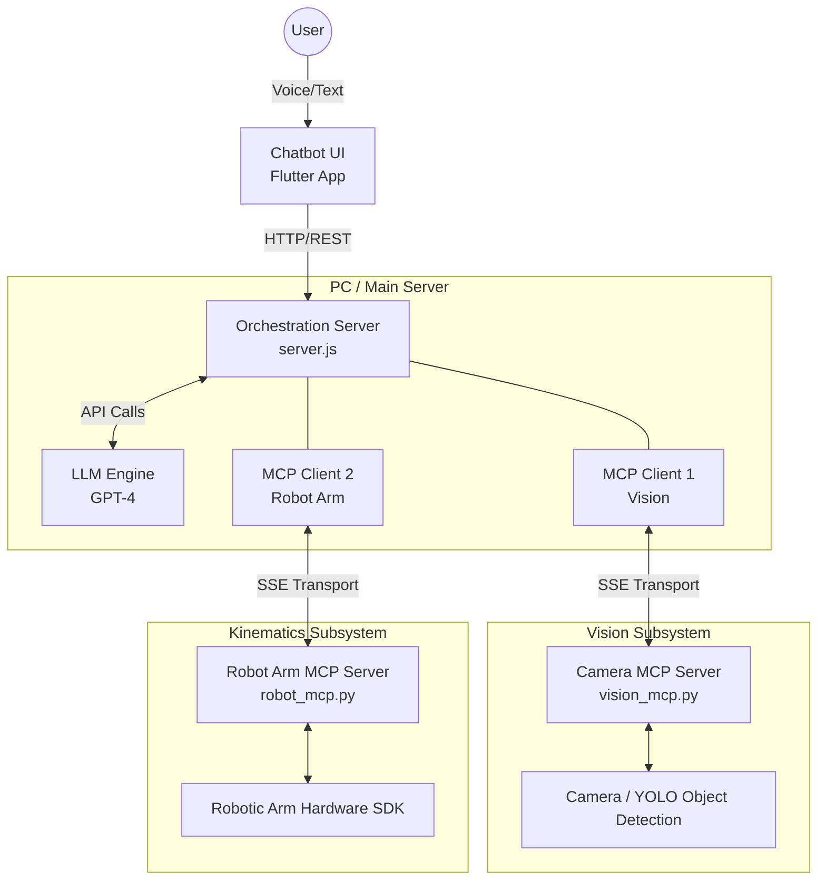

# Roboas

A Flutter-based AI Chatbot integrated with a Computer Vision system and a Robotic Arm via the Model Context Protocol (MCP).

## Multi-Server Robot & Vision Architecture (MCP)

This outlines the system architecture where the **Camera (Vision)** and the **Robotic Arm (Kinematics)** are operating as two completely separate MCP servers. 

In this setup, the LLM acts as the central intelligence orchestrator, chaining the two services together.

### High-Level Architecture Diagram

---

### Network & Port Assignments (Ethernet SSE)

Because the devices communicate over a physical Ethernet network, they must use the **SSE (Server-Sent Events) transport** instead of standard `stdio`. 

The following ports and IP addresses should be configured for the connection:

*   **PC / Orchestration Server (`server.js`)**
    *   **IP:** `192.168.1.100` (Static IP recommended)
    *   **Port:** `3000` (Listens for Flutter App API calls)
*   **Camera Vision Subsystem (`vision_mcp.py`)**
    *   **IP:** `192.168.1.101` (Static IP recommended)
    *   **Port:** `8001` (Listens for SSE connections on `0.0.0.0`)
*   **Robot Arm Kinematics Subsystem (`robot_mcp.py`)**
    *   **IP:** `192.168.1.102` (Static IP recommended)
    *   **Port:** `8002` (Listens for SSE connections on `0.0.0.0`)

---

### Component Roles

#### 1. Main Server (`server.js`)
`server.js` instantiates **two** separate MCP clients (one for the camera, one for the arm). It aggregates the tools from both servers and presents them to the LLM.

#### 2. Camera MCP Server (`vision_mcp.py`)
A standalone MCP server dedicated entirely to computer vision. 
- **Exposes Tools:** `locate_object(target_name)`, `scan_obstacles()`
- **Output:** Returns spatial data (e.g., X,Y,Z coordinates and bounding boxes).

#### 3. Robot Arm MCP Server (`robot_mcp.py`)
A standalone MCP server dedicated to moving motors.
- **Exposes Tools:** `move_to_coordinates(x, y, z)`, `grab()`, `avoid_obstacles(obstacle_list)`
- **Output:** Returns hardware execution statuses (success/fail).

---

### The "Chain of Tools" Flow (Step-by-Step)

Because the Camera and Arm are separate, the **LLM acts as the orchestrator** linking them together. This requires a multi-step "chain of thought" from the AI.

1. **User:** *"Pick up the screwdriver."*
2. **LLM (Step 1):** Realizes it needs to know where the screwdriver is first.
   - **Action:** Calls the Camera Tool: `locate_object({ target: "screwdriver" })`.
3. **Camera MCP:** Captures the frame, runs detection, and returns the data: 
   - `{"found": true, "coordinates": [120, 45, 10], "obstacles": [{"type": "cup", "coords": [100, 30, 0]}]}`
4. **LLM (Step 2):** Receives the coordinates. Now it knows exactly where to move the arm.
   - **Action:** Calls the Arm Tool: `move_to_coordinates({ x: 120, y: 45, z: 10, obstacles: [...] })`.
5. **Robot Arm MCP:** Calculates the path avoiding the cup, moves the arm to `[120, 45, 10]`, and executes the grab. It returns:
   - `{"status": "success"}`
6. **LLM (Final):** Looks at the success message and responds to the user:
   - *"I've used the camera to locate the screwdriver and successfully commanded the arm to pick it up!"*

---

## Instructions for Future AI Implementation

If you (an AI assistant) are tasked with implementing this architecture in `server.js` in the future, follow these exact steps:

1.  **Add SSE Dependencies:** Ensure `SSEClientTransport` from `@modelcontextprotocol/sdk/client/sse.js` is imported in `server.js`.
2.  **Initialize SSE Clients:** Create two separate `SSEClientTransport` connections pointing to the static IPs and Ports of the Vision and Robot Arm MCP servers (e.g., `http://192.168.1.101:8001/sse` and `http://192.168.1.102:8002/sse`).
3.  **Define the Tools:** Inject the JSON schemas for `locate_object`, `scan_obstacles`, `move_to_coordinates`, `grab`, and `avoid_obstacles_and_move` into the `tools` array of the `openai.createChatCompletion` call in the `/ask-gpt` endpoint.
4.  **Handle Tool Calls:** In the `if (responseMessage.tool_calls)` block, add routing logic to check `toolCall.function.name` and forward the specific tool call to the correct MCP client (`mcpVisionClient.callTool` or `mcpArmClient.callTool`).
5.  **Chain the Responses:** Ensure the result from the Vision MCP (like the coordinates) is successfully appended to the GPT `messages` array as a "tool" role message, and trigger a second `createChatCompletion` so the LLM can immediately read the coordinates and call the Arm MCP.

---

## Flutter App Getting Started

This project is a starting point for a Flutter application.

A few resources to get you started if this is your first Flutter project:

- [Lab: Write your first Flutter app](https://docs.flutter.dev/get-started/codelab)
- [Cookbook: Useful Flutter samples](https://docs.flutter.dev/cookbook)

For help getting started with Flutter development, view the
[online documentation](https://docs.flutter.dev/), which offers tutorials,
samples, guidance on mobile development, and a full API reference.
